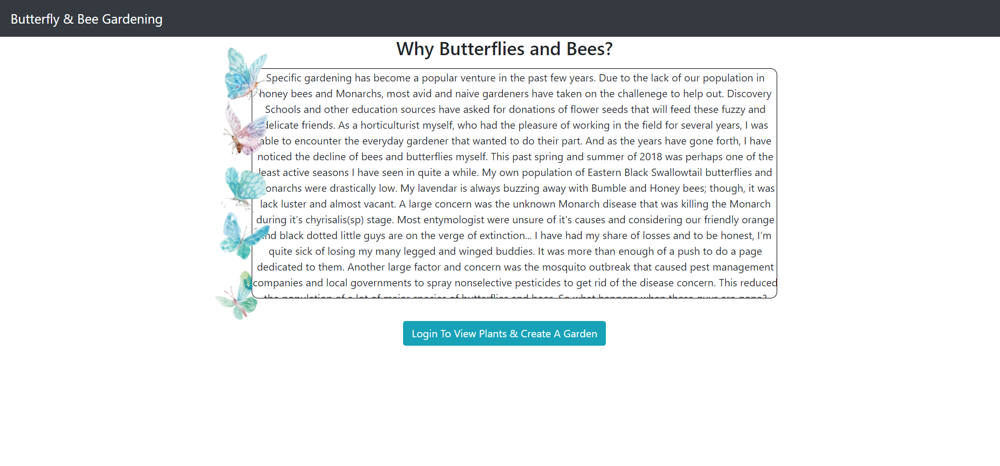
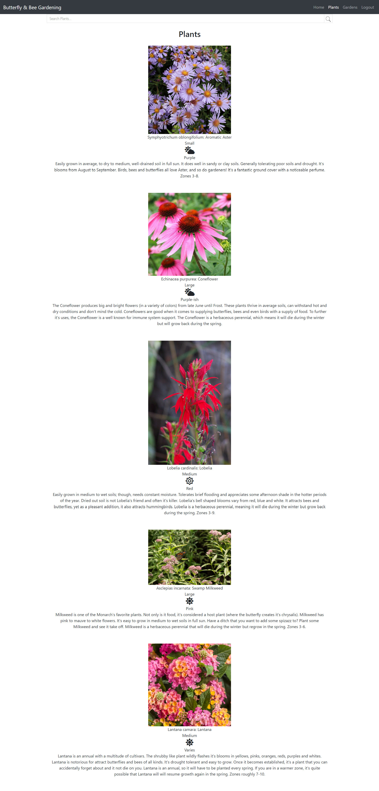
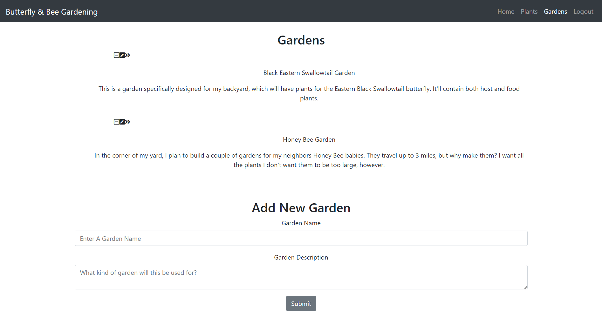
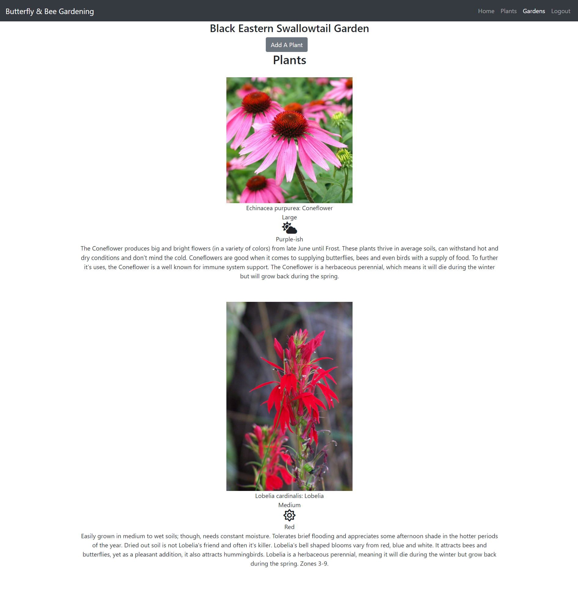
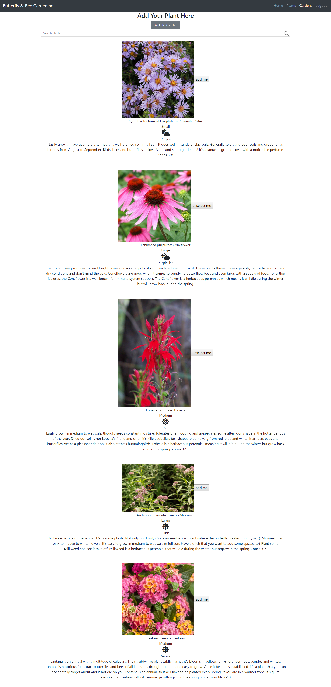

## Butterfly & Bee Gardening 

This particular application is focused around finding the right butterfly and bee gardening plants the users specific needs. The primary user will be the gardener who needs help. I hope that horticulturist in the business of selling plants would also utilize this app, perhaps even with the primary user who is seeking the plant(s). When the user goes to the website, they will have a brief introduction to what butterfly and bee gardening is, along with how important it is to incorporate these plants into their yards. The user will be able to search the plants that I have added to the website initially. Then, they may create a garden. 

A garden? Yes. Say a user wants to have a garden specifically for Clouded Sulphur Butterflies. They can choose plants specific for those butterflies and add the plants they are interested in *into* that garden. It saves in their profile for later use. They can delete said plants, or continue to add more! And the gardens are limitless. Create a garden for every idea! Don't want it anymore? It can be deleted. Changed your title name? Edit it!

A user can search for the plant based off of size, sun requirements, color and name. Plants based on their needs will appear with a photo and a brief description. There will be options to then save the plant if they want, or they can start over and find another plant!

## Technologies Used 

- Webpack/Eslint
- React
- Reactstrap
- Axios
- CRUD
- Firebase
- Javascript
- SCSS/CSS
- HTML
- Gimp

## Screenshots

<!-- 



 -->

## Check it out: Live Demo

[Butterfly & Bee Gardening](https://butterfly-gardening.firebaseapp.com/)

## How to run this project

- Setup a Firebase account if you haven't already. If you have a gmail, you can just go to your Firebase console via your google username.
  + Create a firebase project.
  + Enable Google Authentication under 'Sign-In Method' in the Authentication tab.
  + Create a Firebase database and import the !base .json available in my GitHub repo.
  + Complete the import for Plants, myPlants and Gardens.
  + Go to Database in Firebase and click on the 'Rules' tab. Add the following rule:
```
   ".indexOn":"uid"
 },```
```
  + Clone the repository through your terminal. You will need to use 'SSH' for the clone link.
  + Change it to repository directory in your terminal.
  + At the root of the project `run npm install` to install necessary dependencies.
  + Create an apiKeys.js file (refer to apiKeys.js.example for an example). (Important!!! YOU MUST ADD YOUR API KEYS PATH TO THE .gitignore FILE! EVEN IF YOU ARE NOT PUSHING UP THIS PROJECT -- WHICH SHOULDN'T BE THE CASE AT ALL, IT IS MY PROJECT AFTER ALL -- IT'S BEST IN CASE OF AN ACCIDENT. SAFETY MEASURES FIRST! OPEN API KEYS ARE BAD!)
  + Type npm start in your coding program's terminal to run the project at http://localhost:3000.


This project was bootstrapped with [Create React App](https://github.com/facebook/create-react-app).

## Available Scripts

In the project directory, you can run:

### `npm start`

Runs the app in the development mode.<br>
Open [http://localhost:3000](http://localhost:3000) to view it in the browser.

The page will reload if you make edits.<br>
You will also see any lint errors in the console.


### `npm run build`

Builds the app for production to the `build` folder.<br>
It correctly bundles React in production mode and optimizes the build for the best performance.

The build is minified and the filenames include the hashes.<br>
Your app is ready to be deployed!

See the section about [deployment](https://facebook.github.io/create-react-app/docs/deployment) for more information.

### `npm run eject`

**Note: this is a one-way operation. Once you `eject`, you can’t go back!**

If you aren’t satisfied with the build tool and configuration choices, you can `eject` at any time. This command will remove the single build dependency from your project.

Instead, it will copy all the configuration files and the transitive dependencies (Webpack, Babel, ESLint, etc) right into your project so you have full control over them. All of the commands except `eject` will still work, but they will point to the copied scripts so you can tweak them. At this point you’re on your own.

You don’t have to ever use `eject`. The curated feature set is suitable for small and middle deployments, and you shouldn’t feel obligated to use this feature. However we understand that this tool wouldn’t be useful if you couldn’t customize it when you are ready for it.

## Learn More

You can learn more in the [Create React App documentation](https://facebook.github.io/create-react-app/docs/getting-started).

To learn React, check out the [React documentation](https://reactjs.org/).

### Code Splitting

This section has moved here: https://facebook.github.io/create-react-app/docs/code-splitting

### Analyzing the Bundle Size

This section has moved here: https://facebook.github.io/create-react-app/docs/analyzing-the-bundle-size

### Making a Progressive Web App

This section has moved here: https://facebook.github.io/create-react-app/docs/making-a-progressive-web-app

### Advanced Configuration

This section has moved here: https://facebook.github.io/create-react-app/docs/advanced-configuration

### Deployment

This section has moved here: https://facebook.github.io/create-react-app/docs/deployment

### `npm run build` fails to minify

This section has moved here: https://facebook.github.io/create-react-app/docs/troubleshooting#npm-run-build-fails-to-minify
